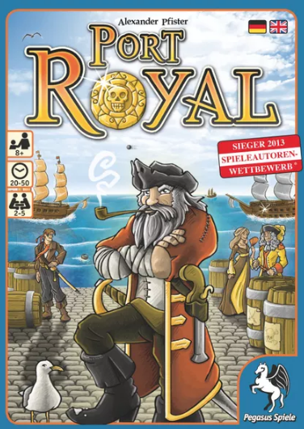

# Port Royal Card Game Python Script

## Table of Contents
- [Introduction](#introduction)
- [Rules of Port Royal](#rules-of-port-royal)
- [How to Use the Script](#how-to-use-the-script)
- [Contributing](#contributing)
- [License](#license)

## Introduction
This Python script is a digital implementation of the card game Port Royal. It allows you to play Port Royal on your computer, either solo or with friends. Port Royal is a popular card game known for its combination of strategy, risk, and reward.

## Rules of Port Royal
Port Royal is a card game for 2 to 5 players. Before using this script, make sure you are familiar with the rules of the game. You can find the official rules [here](https://www.boardgamegeek.com/boardgame/156009/port-royal).

## PyRitesGames
This python game is a remake of the Port Royal Card game. Trade with ships, hire crew, and gain influence in the pirate haven of Port Royal.

The 120-card deck depicts a coin on the back of each card Players earn and pay coins throughout the game for different items on the card fronts. On a turn, a player can first draw as many cards as he likes, one at a time from the deck, placing them in the harbor (an area near the deck). Each card shows one of the following:

 - Person, who stays in a face-up row next to deck.
 - Ship, which the player can attack immediately if he has enough swords on his people cards, after which the ship is discarded. Otherwise, the ship stays in the harbor.
 - Expedition, which remains above the harbor until a player fulfills it by discarding people who have the items required for the expedition.
 - Tax Increase, which forces everyone with twelve or more coins to discard half their money, after which the card is discarded.

If the player draws a ship with the same name as a ship already in the harbor, he's spent too much time dilly-dallying and his turn ends (after using the ship to attack, if possible), with all the cards in the harbor being discarded. Otherwise, the player can stop whenever he likes, then use/acquire one card if three or fewer ships are in the harbor, two cards if four ships are present, and three cards if five ships are present. Players rob ships, collecting the number of coins shown on them, then discarding the card, while they hire people, paying the number of coins depicted. After the active player takes his 1-3 cards, each other player may pay the active player one coin in order to take one card in the same way.

When one player has at least twelve influence points — which are on both people and expedition cards — the game is played to the end of the round, giving everyone the same number of turns, then the player with the most influence points wins.

link to description[https://boardgamegeek.com/boardgame/156009/port-royal]

# Todo List

 - [x] Create cards
 - [x] Create checks
    - [x] Check for valid card on the table
    - [x] Bomber/witzbolt check done
    - [ ] Admiral check
 - [ ] Cards selection for first player

# Logging
Useful links to Python logging
https://realpython.com/python-logging/
https://docs.python.org/3/library/logging.html

# GIT links
remove *.log file from git
git rm --cached <file>

git merge <file>
git branch <file> -d

python -m PyInstaller cli.py

